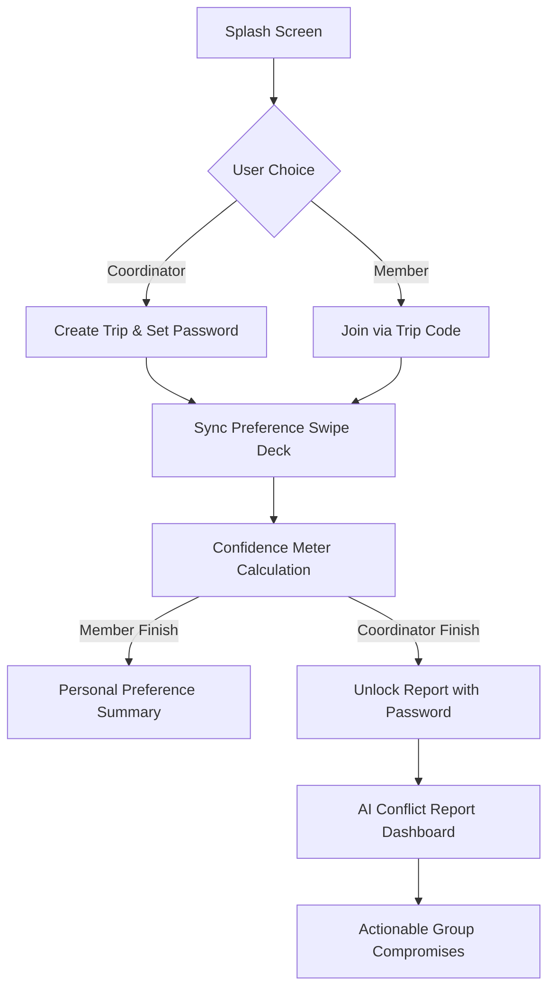

# WANDER AI ✈️

---

## 👥 Team Name:
DON'T HAVE A TEAM SO EITHER I REPRESENT AS FIZA ORELSE "SOLOTECHY".

---
---

## 👥 Team Members

- **Project Lead & Developer**: Fiza fathima pp -[SCHOOL OF ENGINEERING, CUSAT]

---

**Resolve the argument phase. Swipe. Sync. Travel.**

WANDER' AI is a premium, mobile-first group travel decision engine designed to eliminate the friction of planning trips with friends.Whenever a trip is planned at the end it becomes a responsibility of an individual . By moving away from endless group chats and indecision along with different resources at different platforms , WANDER' AI uses an intuitive, swipe-based preference selection system to anonymously gather group choices and generate an "AI-driven" conflict report with actionable compromises.it includes accessibility features , preferances of the entire trip and finalizes it into a single destination according to everyones budget and comfort.

---

## 🚀 Features

● **Swipe-to-Sync Engine**: An intuitive card-based interface for selecting travel preferences (Climate, Destinations, Food, Activities, Stays, and Amenities).  
● **Real-time Confidence Meter**: Visual tracking of group momentum and agreement percentages during the swiping phase.  
● **AI Conflict Report**: A password-protected dashboard for the coordinator, highlighting group consensus, detecting clashing preferences, and suggesting ideal compromises.  
● **Privacy-First Voting**: Anonymous member preferences ensure honest feedback without group pressure.  
● **One-Click Sharing**: Generate 6-digit trip codes and QR codes for instant member onboarding via WhatsApp, email, or direct link.  
● **Single-File Architecture**: No complex setup required—runs anywhere.

---

## 🛠️ Tech Stack

- **Core**: HTML5, Vanilla JavaScript (ES6+).
- **Styling**: Modern CSS3 with custom variables and a mobile-first responsive design.
- **Typography**: Clash Display & Satoshi via [Fontshare](https://fontshare.com).
- **Utilities**: `qrcode.js` for dynamic QR code generation.
- **Data Management**: Browser-native `localStorage` for high-performance offline-first data persistence.

---

## 📸 Screenshots

| Splash Screen | Final Results |  Swiping Interface |
| :---: | :---: | :---: |
|  |  |  |

---

## 🏗️ Architecture Diagram



---

## 📥 Installation

1. **Clone the repository:**
   ```bash
   git clone https://github.com/Fizafathimapp/tinker_her_hack.git
   ```
2. **Navigate to the directory:**
   ```bash
   cd tinker_her_hack
   ```

---

## 🏃 Run Commands

The application is built on a single-file architecture for maximum portability.

- **Option 1: Direct Execution**  
  Simply open `index.html` in any modern web browser.

- **Option 2: Local Server (Recommended for best experience)**  
  ```bash
  # Using Python
  python -m http.server 8000
  ```
  Then visit `http://localhost:8000`.

---

## 📖 API Documentation (Internal Data Structure)

WANDER' AI uses a lightweight local storage schema. No external backend is required for the demo.

### Storage Keys
- `tripmaker_trips`: An object where keys are 6-digit `tripCodes`.

### Data Model
```json
{
  "123456": {
    "tripName": "Bali 2025",
    "password": "hashed_password",
    "members": [
      { "name": "Alex", "id": "m1", "done": true },
      { "name": "Sam", "id": "m2", "done": false }
    ],
    "coordinatorPreferences": { ... },
    "memberPreferences": {
      "m1": { "name": "Alex", "selections": { ... } }
    }
  }
}
```

---

## 🎥 Demo Video

[Watch the Demonstration Video Here](https://example.com/demo-video-placeholder) *(Link to be updated after recording)*

---

## 📄 License

This project is licensed under the **MIT License**. Feel free to use and modify it for your own hacks!
